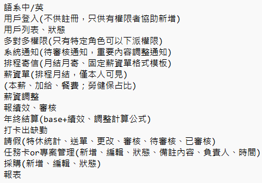

# 練習用的專案
~~先簡單設個目標，不然我怕會越研究越深最後什麼都做不出來XD~~  
主要是想練習SpringSecurity+JWT做用戶登入和權限驗證  
權限設計用RBAC(Role-Base-Access-Control)的方式  
(權限粒度切到最細，每支api有對應權限，也可以靠" url/** "匹配特定路徑下所有api)    
i18n控制api響應結果
javaMail
Redis緩存  
前端Vus.js  
資料庫SpringDataJpa + MSSQL  
~~順便練習TDD和測試(測試最後再補，花太多時間了)  
剩下有想到再補~~

SpringSecurity筆記:https://hackmd.io/@S1MNxjTORYSfAfivxMlEQw/rykdZBNEa

***
## 2024.1.2
舊設計棄置(branch master_abandoned)  
主要使用技術不變  
權限都改為多對多  
i18n僅保留中/英  
目標比較明確了，主結構會按照下列去完成  
