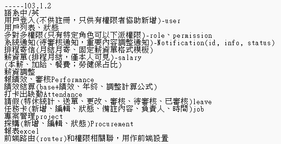

# 練習用的專案
~~先簡單設個目標，不然我怕會越研究越深最後什麼都做不出來XD~~  
主要是想練習SpringSecurity+JWT做用戶登入和權限驗證  
Java 17  
Spring Boot 3.1.5  
Spring Data JPA + Microsoft SQL Server (MSSQL)  
Spring Security + JWT (RBAC實現權限控制)  
國際化(i18n) 只做繁中/英文  
Websocket 做即時系統通知  
Quartz 做任務調度(如月結薪資，刷新每日打卡紀錄)  
jxls 生成Excel报表  
javaMail + Thymeleaf  
Redis 用於緩存  
Swagger 產出API文件  
Mockito + Junit5 用於單元測試、集成測試  
Jasypt 做配置脫敏  
~~順便練習寫TDD和測試(測試最後再補，花太多時間了)  
剩下有想到再補~~

SpringSecurity筆記:https://hackmd.io/@S1MNxjTORYSfAfivxMlEQw/rykdZBNEa
Quartz:https://hackmd.io/@S1MNxjTORYSfAfivxMlEQw/S1tkrG_pC
Jasypt:https://hackmd.io/@S1MNxjTORYSfAfivxMlEQw/rJvzRwQkke
***
## 2024.1.2
舊設計棄置(branch master_abandoned)  
主要使用技術不變  
權限都改為多對多  
i18n僅保留中/英  
目標比較明確了，主結構會按照下列去完成  
  
整體內容大致都想好怎麼做了  
~~就是剩下權限控管的部分，因為要區分前後端  
不太確定到底該怎麼切~~  
(  
想到前公司大型專案架構中Menu的存在，對應到Vue-router的Name就可以保證控制前端頁面權限的邏輯   
)  

目前就是緩存設計也不太成熟  
利用區分cacheName來切分不同區塊緩存刷新  
但緩存內資料複雜，又有多方關聯(像是client對多個entity都是ManyToMany之類的)  
只刷單一區塊會變成刷不乾淨，全刷又太浪費  
再想辦法處理  
目前待處理有  
(  
1.緩存寫unitTest?主要是只想針對緩存做測試，不想為了cache test完整啟動springboot上下文    
2.配置類寫測試的必要性?(最後是決定不管覆蓋率只測Service類邏輯正確，整體完整性用IntegrationTest測試)  
3.解決緩存關聯的重點應該是放在DTO的切分，寫ORM要做好習慣Entity就真的只用在Repository操作，出資料庫就要轉DTO不然多線關聯很容易出現懶加載問題，總不可能全部都加載到底，寫完所有東西寫測試才注意到這個問題，現在就是維持一個微妙平衡先不解了XD  
)

***
## 2024.3.19
後端部分API大致完成  
總結對SpringSecurity+JWT的實現以及理解  
先實現UserDetails，用於驗證該用戶狀態及權限  
先實現UserDetailsService，用於登入驗證時使用userName找到該用戶，返回UserDetails實現類  
把先前實現的UserDetailsService類注入AuthenticationProvider(DaoAuthenticationProvider)  
SecurityFilterChain設置.addFilterBefore(JwtFilter, UsernamePasswordAuthenticationFilter.class)
之後登入就會先進行JWT驗證才會走到security的權限驗證  
這邊的API權限設置也都是用動態加載的方式設置在SecurityFilterChain  
後續流程:  
用戶註冊時，密碼經由指定的PasswordEncoder(像這邊是使用BCryptPasswordEncoder)  
加密後存入資料庫  
後續用戶發起登入請求，把帳密放進UsernamePasswordAuthenticationToken  
進行.authenticate(會使用先前實現的UserDetailsService類進行驗證)  
驗證帳號密碼是否通過和驗證該用戶相關狀態  
如果通過就產出並核發JWT返回  
(如果有勾選rememberMe才會返回refreshToken，否則就是單依靠accessToken做後續操作)  
並且因為SecurityContext只保留再請求的生命週期間  
之後登入成功後的每個請求流程都是:  
Filter驗證AccessToken是否過期是否有效，  
RefreshToken用於刷新AccessToken，
刷新時機由前端控制，前端驗證AccessToken過期會發起刷新請求  
後單驗證過程中只要是過期以外的錯誤都是直接返回403  
並且只要沒有拋出(JWT驗證通過)  
就必須透過JWT內儲存的用戶資訊產出Authentication以利該請求進行後續權限驗證  
(目前是只存用戶名稱，想秉持用戶驗證和權限驗證的獨立性但不確定優劣)  
然後因為是每次用戶請求都會產生新的Authentication(不想把權限放進JWT)，所以權限是即時更新的
但缺點就是每次請求都要查詢當下權限，目前是只想到利用緩存優化  
另外  
~~這邊JWT設計是用非對稱式加密  
公鑰給前端，前後都需要驗證JWT時效和簽名~~  
2024.4.24:  
我的理解錯誤，這邊目前是修改為前端只進行時效驗證因為不需要密鑰  
簽名驗證因為有密鑰隱私問題，由後端負責  
JWT做非對稱加密的作用應該是比較偏向多服務間的後端溝通，不是前後端溝通

***
## 關於測試(UnitTest、IntegrationTest)
補充紀錄一下，寫測試的過程也是曲折離奇XD  
主要就是junit5、mockito  
單元測試基本只寫Service類，當初沒有採用TDD，API大致都開發完才開始寫測試  
開發初期就是單純用Postman做測試，但因為後面引入SpringSecurity(還好是將近最後才完善)，API都需要權限驗證，手動測試需要先登入拿權限才能往下測，整個過程冗到爆  
真的是自己從頭開始寫，到寫了測試才懂測試的好QQ  
這邊沒有要求覆蓋率，主要是因為某些方法就單純是過渡，真心覺得寫了也是浪費時間  
工作上沒要求寫測試，網路爬文也是眾說紛紜(關於要求覆蓋率)  
後面因為主要邏輯都歸在Service類內因此單元測試只測Service類的方法  
  
然後為了驗證配置類的運作正常(Ex:SpringSecurity的權限我是寫在DB，需要確保專案啟動後動態加載的正常運作)，這我實在是想不到怎麼用mockTest，所以就變成寫IntegrationTest  
又為了維持離線測試隔離外部，這邊分別是用H2取代DB以及embedded-redis取代的redis  
目前缺陷就是雖然ORM不是寫SQL但DB預設資料的部分還是得靠SQL INSERT，H2還需要另外改一版，不能混用原先的SQL(後來才想到塞初始化資料可以用CommandLineRunner)  
~~除此之外還需要調適就是針對每台機器差異性?主要開發都是在公司電腦，測試也都完全沒問題，但切回家用電腦測試程式碼會有偶發性的加載失敗錯誤，排查不出結果先擱置~~(後續排查發現是運行測試embedded-redis預留空間內存不足，所以時好時壞每台電腦結果也不同，在TestRedisConfiguration加上針對redis配置maxheap就解決了)
  
然後整體測試大概是  
IntegrationTest: 180支  
UnitTest: 200支  
大致考量所有可能性  
Service類覆蓋率大概都在90%，其餘不管  
我也不知道這重不重要就做個紀錄

※最後針對IntegrationTest有個問題就是，最好的測試其實是每個測試都完全隔離，但因為IntegrationTest需要完整加載spring上下文以及配置，變成跑100支測試就需要完整重複加載100次?很疑惑，目前就是折衷一個Controller類只重複加載一次而已(@SpringBootTest)

***
## 2024.10.8
專案整體完成
後端相對前端開發問題少很多，就這邊留個紀錄  
1. 真的要養成筆記習慣，邊寫邊做，之前都太輕視這部分，很多時候遇到問題當下解決就過了，但過一陣子都很難再回憶起遇到過什麼坑
2. SpringSecurity結合JWT的部分，一開始是在網路上找範例嘗試，結果找到的範例是驗證邏輯自定義處理掉，後續看sourceCode發現其實某些驗證是security默認會做，不需要又另外複寫，但就沒繼續往下改了維持目前這樣
3. 關於用戶驗證和鑑權拆分，這部分好像找不到一個標準說法，到底是要  
   1. 產出JWT順便把權限存入，後續都只要解JWT鑑權  
   2. JWT單純控制只用於辨識用戶，再自己檢查權限  
   
   前者比較沒有資源浪費問題但是權限更新不及時，只能透過重複登入拿新的Token來刷新權限，也不確定存權限有沒有安全疑慮，後者則是實時刷新權限，但資源浪費每次動作都要檢查權限?Token單純就是辨識用戶，要縮減浪費目前是只透過緩存，不確定怎麼做比較好
4. Websocket使用，這邊是用在即時的系統通知，一開始想法是希望當有重要的操作或更動可以即時顯示通知，但後續發現其實只會有單向，用SSE好像就足夠了?  
   而且也會有權限疑問，不可能隨便就能讓人連線，但要在握手階段檢查權限除了直接用URL帶參數的方式帶入Token，試不出其他方式，測試放header在握手階段也拿不到，先連上再進行權限驗證也很奇怪，不確定是不是有其他方式    
   然後目前用戶封鎖或停用的設計也是透過Websocket往client端丟提示觸發前端踢出用戶，感覺怪怪的但暫時想不到其他解法，其他解法(session?)也只針對後端，前端沒辦法做到主動踢出
5. swagger太晚才嵌入，後續其實有點懶得去改了，所以文檔產出其實不是很完整，測試功能也沒有調通，想說API可用性依靠自動測試就可以了
6. 設定檔脫敏部分後續有用jasypt做掉，一開始就應該要注意Git不要上到敏感資訊，不然後續還要用Git filter-repo處理commit紀錄很麻煩
7. 目前專案啟動流程:  
   1. 資料庫配置 
   2. redis配置,啟動  
   3. 後端專案因為有配置jasypt,啟動要下指令帶入密鑰    
      手動運行test.java.com.erp.base.tool.JasyptEncodeTest,   
      產出後寫進properties對應屬性ENC(密文)--資料庫設定和mail設定  
      mvn clean package打包,  
      java "-Djasypt.encryptor.password=密鑰" -jar ./target/erp-0.0.1.jar啟動包  
      (intellij的terminal默認是powershell, 如果是cmd就去掉雙引號)
   4. 前端專案啟動
8. 專案部屬在GCP，筆記:https://hackmd.io/@S1MNxjTORYSfAfivxMlEQw/r1oiE-j-yg

